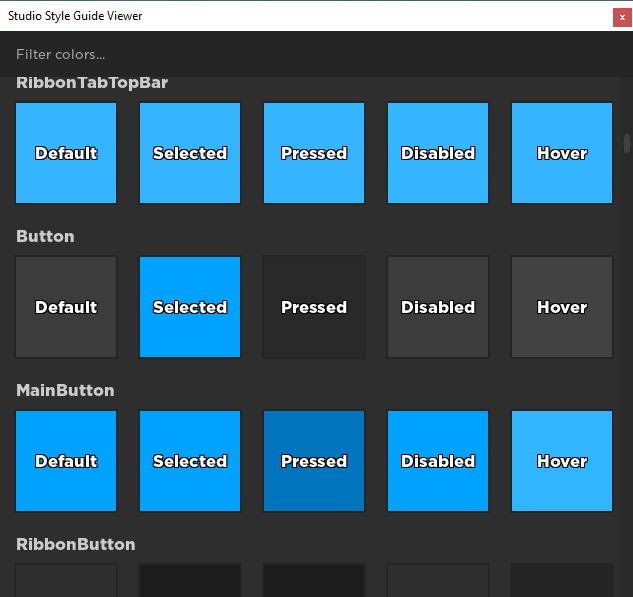
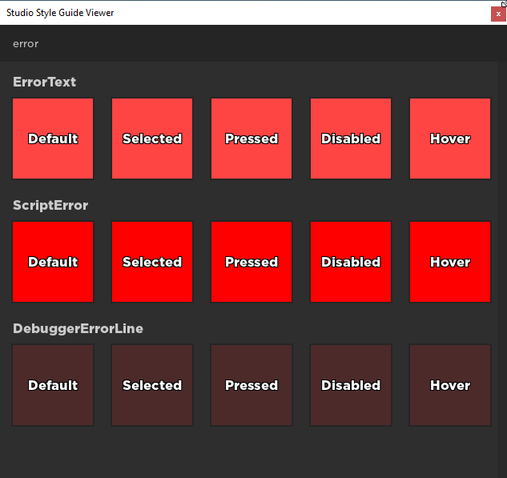

# Style Guide Viewer

This plugin gives you easy visualization of all the [StudioStyleGuideColors](https://developer.roblox.com/en-us/api-reference/enum/StudioStyleGuideColor) and their various modifiers.

Since there are so many, you can filter them down as well:

This plugin is also responsive to the current Studio theme. If you're using Dark theme and you want to see what the colors look like in Light theme, simply go into your settings and switch themes.
